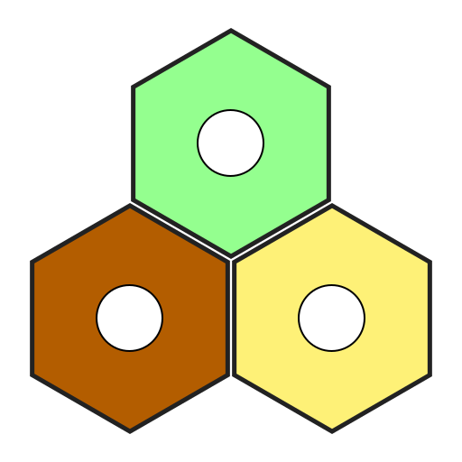

#  SettlersOfSatan

Hosted [here](http://settlersofsatan.herokuapp.com/)

This project is a project made in the summer of 2021.
It is a completely original game that is not in any way related to or a clone of Settlers of Catan.

Written with Vue, ExpressJS, and SocketIO, using Node.JS.
I no longer remember what most of this code does.
It is very badly organised and does not seem to be properly commented.
I would like to believe that I am a better programmer now than when I wrote this.
~ Billzo


**Hoang's Description**
```
totally not catan gamers we have made a thing that replicates not catan. it is about satan and i do not love satan. 
thanks to bill and liam, we have creawted a whoadnerfgual thing called settlers of satan
it is not a copy of catan because we have epic drawings by hangman now you will perish
```